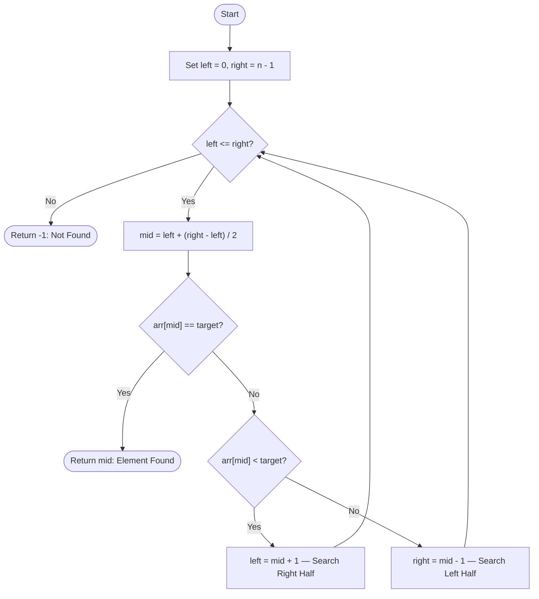

# Binary Search

> A fundamental computer science algorithm for efficiently locating a target value within a **sorted** collection.

---

## Table of Contents

- [Overview](#overview)
- [Algorithm Details](#algorithm-details)
- [Complexity Analysis](#complexity-analysis)
- [Flow Diagram](#flow-diagram)
- [Approaches](#approaches)
- [Real-Life Applications](#real-life-applications)
- [Edge Cases](#edge-cases)

---

## Overview

Binary Search is a **divide and conquer** searching algorithm that operates on sorted arrays. Rather than scanning each element sequentially, it eliminates half of the remaining search space with every comparison — making it one of the most efficient search algorithms available.

**Core Idea:** At each step, compare the target with the middle element. Depending on whether the target is smaller or larger, discard the half that cannot contain the target and repeat on the remaining half.

> **Prerequisite:** The input array or list **must be sorted** in ascending (or descending) order before applying Binary Search.

---

## Algorithm Details

### Step-by-Step Breakdown

1. Initialize two pointers: `left = 0` and `right = n - 1` (where `n` is the size of the array).
2. While `left <= right`:
   - Compute `mid = left + (right - left) / 2`
     *(This avoids integer overflow compared to `(left + right) / 2`)*
   - If `arr[mid] == target` → Element found, return `mid`.
   - If `arr[mid] < target` → Target lies in the right half, set `left = mid + 1`.
   - If `arr[mid] > target` → Target lies in the left half, set `right = mid - 1`.
3. If the loop ends without finding the target, return `-1` (not found).

### Example Walkthrough

Given sorted array: `[2, 5, 8, 12, 16, 23, 38, 45, 67, 90]`, target = `23`

| Iteration | left | right | mid | arr[mid] | Action |
|-----------|------|-------|-----|----------|--------|
| 1 | 0 | 9 | 4 | 16 | 16 < 23 → move left right |
| 2 | 5 | 9 | 7 | 45 | 45 > 23 → move right left |
| 3 | 5 | 6 | 5 | 23 | 23 == 23 → **Found at index 5** |

---

## Complexity Analysis

| Metric | Iterative | Recursive |
|--------|-----------|-----------|
| **Best Case Time** | O(1) | O(1) |
| **Average Case Time** | O(log n) | O(log n) |
| **Worst Case Time** | O(log n) | O(log n) |
| **Space Complexity** | O(1) | O(log n) |

> The recursive approach uses additional space due to the **call stack** growing proportionally to the depth of recursion (log n levels deep).

---

## Flow Diagram

---

## Approaches

### Iterative Approach

Implements Binary Search using a `while` loop. The search range is updated in-place using the `left` and `right` pointers without any additional function calls.

- **Advantage:** Constant space — O(1) memory usage.
- **Best suited for:** Performance-critical applications where memory overhead must be minimized.

### Recursive Approach

Implements Binary Search by calling the function on a reduced subarray at each step. The base case is when `left > right`, returning `-1`.

- **Advantage:** Cleaner, more intuitive code that closely mirrors the mathematical definition.
- **Trade-off:** Each recursive call adds a stack frame — O(log n) space.

---

## Real-Life Applications

### 1. Dictionary & Phonebook Lookup
When searching for a word in a dictionary, you instinctively open to the middle, determine whether the word comes before or after, and narrow down — this is Binary Search in its most natural form.

### 2. Database Indexing
Relational databases (MySQL, PostgreSQL, SQLite) use **B-Trees** and **B+ Trees** — tree-based generalizations of Binary Search — to perform fast indexed lookups without scanning entire tables.

### 3. Version Control — `git bisect`
`git bisect` applies Binary Search across commit history to identify the exact commit that introduced a bug. It checks the commit halfway between a known good and bad state, then iteratively narrows the range.

### 4. Search in Sorted UI Lists
Applications with alphabetically or numerically sorted lists (e.g., contacts, file explorers, music libraries) internally use Binary Search to locate entries in O(log n) time rather than scanning linearly.

### 5. Numeric Computation — Square Root & Power Functions
Binary Search is used to compute results like square roots and powers to a given precision. For example, finding √x means searching for a value `m` such that `m * m ≈ x` within a defined range.

### 6. Network Packet Routing
Routers use sorted routing tables and Binary Search-based lookups (longest prefix match) to forward packets efficiently across large networks.

### 7. Machine Learning — Hyperparameter Tuning
Binary Search is applied in optimization routines to find learning rates, thresholds, or other hyperparameters that minimize a loss function within a bounded range.

### 8. The Classic Guessing Game
"Pick a number between 1 and 100." The mathematically optimal strategy is always to guess 50, then 25 or 75 based on the hint — guaranteed to find the answer in at most 7 guesses. This is Binary Search.

---

## Edge Cases

| Scenario | Expected Behavior |
|----------|------------------|
| Empty array | Return `-1` immediately |
| Single element — matches target | Return index `0` |
| Single element — does not match | Return `-1` |
| Target smaller than all elements | Return `-1` |
| Target larger than all elements | Return `-1` |
| Duplicate elements | Returns *one* valid index (not guaranteed to be first/last) |
| Target at first index | Found in O(log n) |
| Target at last index | Found in O(log n) |

---

## Why `mid = left + (right - left) / 2`?

Using `(left + right) / 2` can cause **integer overflow** when `left` and `right` are both very large integers (close to `INT_MAX`). The expression `left + (right - left) / 2` produces the same midpoint value mathematically but is **overflow-safe** and is considered best practice.
